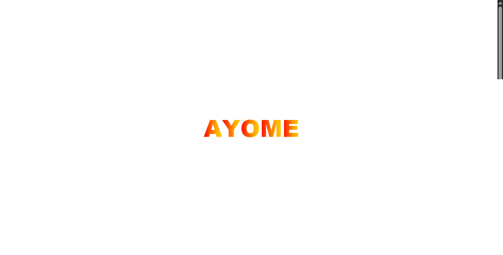

# AYOME Animation

Halaman ini menampilkan animasi teks "AYOME" dengan efek gradasi warna pelangi dan animasi pop-in menggunakan HTML, CSS, dan JavaScript.

## Fitur
- Animasi teks dengan gradasi warna pelangi.
- Efek pop-in pada setiap huruf secara berurutan.
- Responsive dan ringan, hanya menggunakan HTML, CSS, dan sedikit JavaScript.

## Cara Menjalankan
1. Buka file `index.html` di browser.
2. Animasi akan langsung tampil di halaman utama.

## Struktur File
- `index.html` — Berisi kode utama untuk animasi teks AYOME.

## Keterangan
Animasi ini cocok untuk splash screen, logo, atau heading website bertema modern dan colorful.

